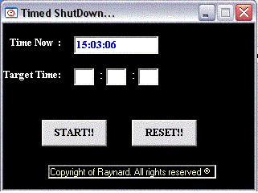



## Force Timed Shut Down

### Description

This program will use the WIndows API call and call to the system to force yr PC to shut down when you predefine a time to shut down. When the time is reached, it will immediately force the system to shut down entirely..Good for using this when you are downloading stuff in teh middle of the night and you are tired, but the data will only be donwload complete in 2 hrs 15min and 45 secs time, then u can set the time to shut down so that you will save more on your electricity bill and prevent yr PC from overheating..
 
### More Info
 

             |
---                |---
**Submitted On**   |2002-03-07 13:12:40
**By**             |[\~RayNarD\~](https://github.com/Planet-Source-Code/PSCIndex/blob/master/ByAuthor/raynard.md)
**Level**          |Intermediate
**User Rating**    |5.0 (10 globes from 2 users)
**Compatibility**  |VB 5\.0, VB 6\.0
**Category**       |[Windows API Call/ Explanation](https://github.com/Planet-Source-Code/PSCIndex/blob/master/ByCategory/windows-api-call-explanation__1-39.md)
**World**          |[Visual Basic](https://github.com/Planet-Source-Code/PSCIndex/blob/master/ByWorld/visual-basic.md)
**Archive File**   |[Force\_Time14890210302002\.zip](https://github.com/Planet-Source-Code/raynard-force-timed-shut-down__1-40258/archive/master.zip)

### API Declarations

Everything in the codes and module itself..

